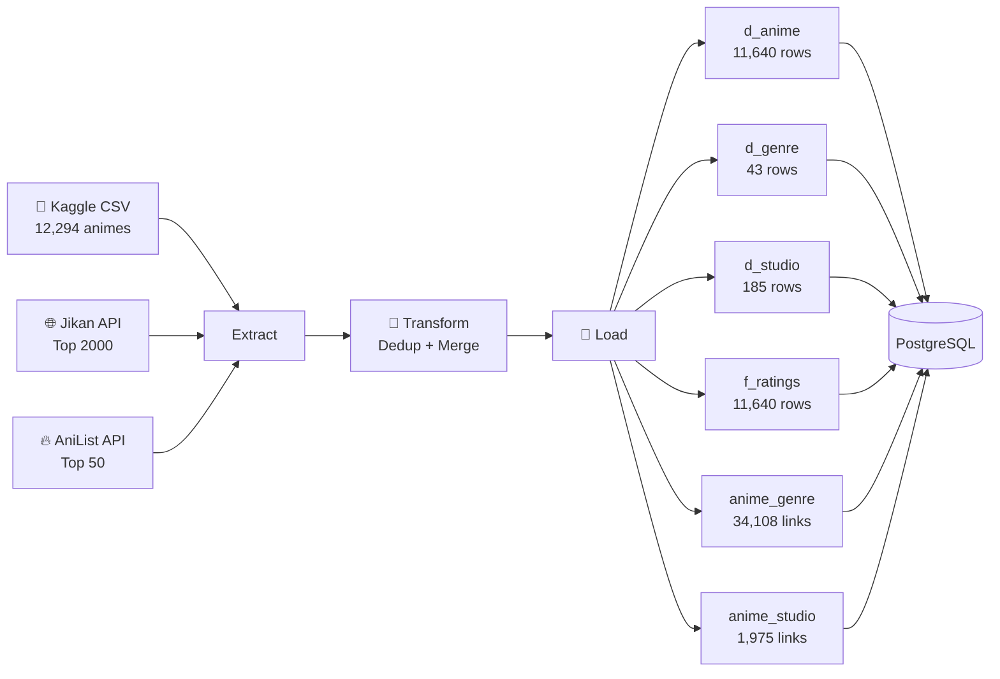
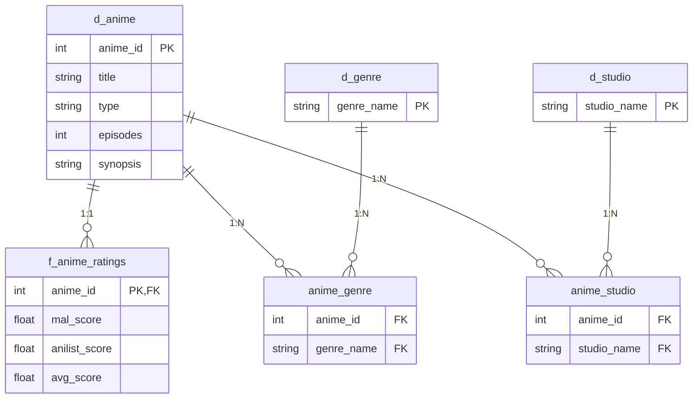
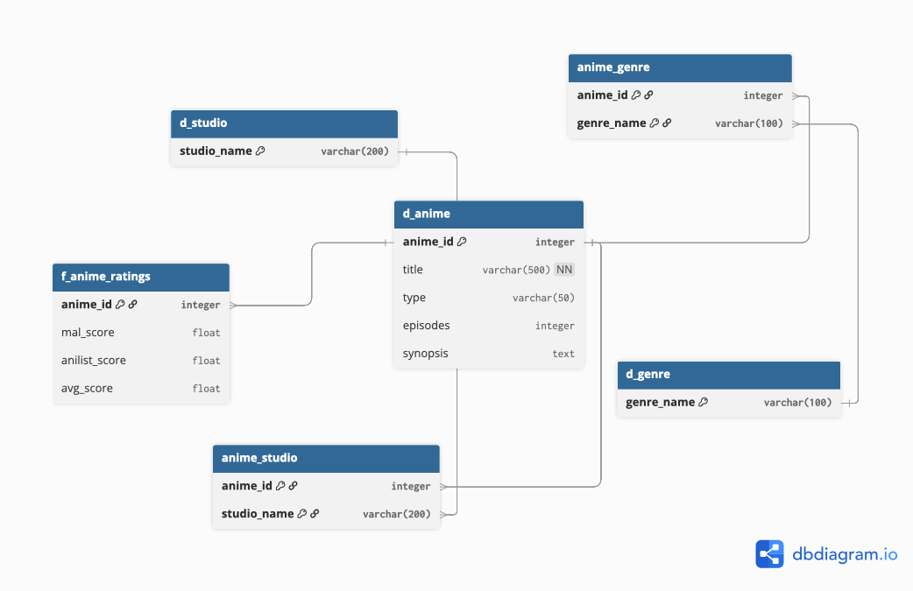

# 🎌 Anime ETL Pipeline

[](https://www.python.org/)
[](https://www.postgresql.org/)
[](https://www.docker.com/)
[](.)
[](.)
[](.)
[](https://opensource.org/licenses/MIT)

> **Production-ready ETL pipeline** extracting anime data from multiple sources, transforming it into a star schema, and loading it into PostgreSQL.

**One-command deployment:** `docker-compose up` ✨

---

## 🎥 Demo Video


[](https://youtu.be/_MzISSsc05I)

*Full walkthrough: Docker deployment, SQL queries, and test results*

---


## 📋 Table of Contents

- [Features](#-features)
- [Quick Start](#-quick-start)
- [Architecture](#️-architecture)
- [Database Schema](#-database-schema)
- [Technologies](#-technologies)
- [Development](#️-development)
- [Sample Queries](#-sample-queries)
- [Project Structure](#-project-structure)
- [Performance](#-performance)

---

## ✨ Features

### Data Sources
- 📊 **Kaggle Dataset** — 12,294 animes with ratings, genres, studios
- 🌐 **Jikan API** — Top 2,000 animes with detailed metadata (MyAnimeList)
- 🔥 **AniList GraphQL** — Top 50 trending animes with scores

### ETL Pipeline
- 🔄 **Fuzzy Deduplication** — RapidFuzz matching (90% threshold)
- 🎯 **Score Aggregation** — MAL, AniList, and Kaggle scores merged
- ⭐ **Star Schema** — Optimized OLAP design with fact/dimension tables
- 🐳 **Docker Ready** — One-command deployment with docker-compose
- 📈 **Rate Limiting** — Jikan (3 req/s), AniList (90 req/min)
- ✅ **Comprehensive Tests** — 56 tests, 95.6% coverage, MyPy strict
- 📝 **Professional Logging** — YAML-configured with rotation

---

## 🚀 Quick Start

### Prerequisites
- Docker & Docker Compose
- 2GB free disk space
- ~45 minutes for initial run

### One-Command Setup
```bash
# Clone the repository
git clone https://github.com/YOUR_USERNAME/anime-etl.git
cd anime-etl

# Start everything (builds + runs pipeline)
docker-compose up
```

**That's it!** ✅ 

The pipeline will:
1. Extract data from Kaggle CSV, Jikan API, and AniList API
2. Transform and deduplicate: 12,294 → 11,640 animes
3. Load into PostgreSQL star schema

**Access the database:**
```bash
psql -h localhost -U anime_user -d anime_db
# Password: anime_password
```

### Local Development (without Docker)
```bash
# Install dependencies with uv
pip install uv
uv sync

# Start PostgreSQL only
docker-compose up -d postgres

# Configure environment
cp .env.template .env
# Edit .env if needed (defaults work with Docker)

# Run pipeline
uv run pipeline.py

# Run tests
uv run pytest
```

---

## 🏗️ Architecture

### Pipeline Flow


### Key Components

**Extract (`src/extract.py`)**
- Kaggle CSV reader with pandas
- Jikan REST API client (3 req/s rate limit)
- AniList GraphQL client (90 req/min rate limit)
- Retry logic with exponential backoff

**Transform (`src/transform.py`)**
- Title normalization (lowercase, remove accents, punctuation)
- Fuzzy matching deduplication with RapidFuzz
- Score aggregation (MAL priority → Kaggle fallback → AniList normalization)
- Vectorized pandas operations (10-50x faster than iterrows)

**Load (`src/load.py`)**
- Star schema creation with proper constraints
- Batch inserts with SQLAlchemy
- Automatic rollback on errors with `engine.begin()`

---

## 📊 Database Schema

### Star Schema Overview



### Detailed Schema



*Full star schema with all fields, types, and constraints*

---

## 🔧 Technologies

| Technology | Version | Purpose |
|-----------|---------|---------|
| **Python** | 3.14 | Runtime |
| **PostgreSQL** | 17 | Database (Docker) |
| **pandas** | 2.3.3 | Data transformations |
| **SQLAlchemy** | 2.0.41 | ORM & database connections |
| **RapidFuzz** | 3.13.0 | Fuzzy matching deduplication |
| **requests** | 2.32.4 | HTTP client for Jikan API |
| **graphql-core** | 3.2.6 | AniList GraphQL client |
| **pytest** | 8.4.2 | Testing framework |
| **mypy** | 1.15.0 | Static type checking |
| **Docker** | Latest | Containerization |

---

## 📊 Data Sources

### Kaggle Anime Dataset
- **Source:** [Kaggle - Anime Recommendations Database](https://www.kaggle.com/datasets/CooperUnion/anime-recommendations-database)
- **Records:** 12,294 animes
- **Fields:** anime_id, name, genre, type, episodes, rating, members
- **Last Updated:** September 2019
- **License:** CC0: Public Domain

### Jikan API (MyAnimeList)
- **Endpoint:** https://api.jikan.moe/v4
- **Rate Limit:** 3 requests/second
- **Records Fetched:** Top 2,000 animes by members
- **Fields:** synopsis, studios, themes, demographics, relationships
- **Documentation:** [Jikan API Docs](https://docs.api.jikan.moe/)

### AniList GraphQL API
- **Endpoint:** https://graphql.anilist.co
- **Rate Limit:** 90 requests/minute
- **Records Fetched:** Top 50 trending animes
- **Fields:** trending rank, average score, popularity
- **Documentation:** [AniList API Docs](https://anilist.gitbook.io/anilist-apiv2-docs)

---

## 🛠️ Development

### Running Tests
```bash
# All tests with coverage
uv run pytest

# Unit tests only
uv run pytest tests/unit/ -v

# Integration tests (requires PostgreSQL)
uv run pytest tests/integration/ -v

# Coverage report
uv run pytest --cov-report=html
open htmlcov/index.html
```

### Type Checking
```bash
# Run MyPy strict mode
uv run mypy src/ --strict
```

### Code Quality
```bash
# Check for issues
flake8 src/ tests/

# Auto-format
black src/ tests/
```

---

## 🔐 Environment Variables

**Available variables:**

| Variable | Default | Description |
|----------|---------|-------------|
| `DB_HOST` | `localhost` | PostgreSQL host (use `postgres` for Docker) |
| `DB_PORT` | `5432` | PostgreSQL port |
| `DB_NAME` | `anime_db` | Database name |
| `DB_USER` | `anime_user` | Database user |
| `DB_PASSWORD` | `anime_password` | Database password |
| `JIKAN_API_BASE_URL` | `https://api.jikan.moe/v4` | Jikan API endpoint |
| `ANILIST_API_URL` | `https://graphql.anilist.co` | AniList API endpoint |
| `DATA_RAW_PATH` | `data/raw` | Path to raw data files |

**Note:** Rate limits are hardcoded in the application (Jikan: 3 req/s, AniList: 90 req/min) as per official API documentation.

---

## 🔍 Sample Queries

### Top 10 Animes by Score
```sql
SELECT 
    a.title,
    r.avg_score,
    a.type,
    a.episodes
FROM d_anime a
JOIN f_anime_ratings r ON a.anime_id = r.anime_id
ORDER BY r.avg_score DESC
LIMIT 10;
```

### Most Popular Genres
```sql
SELECT 
    g.genre_name,
    COUNT(*) as anime_count
FROM d_genre g
JOIN anime_genre ag ON g.genre_name = ag.genre_name
GROUP BY g.genre_name
ORDER BY anime_count DESC
LIMIT 10;
```

### Top Studios by Production Count
```sql
SELECT 
    s.studio_name,
    COUNT(*) as anime_produced,
    ROUND(AVG(r.avg_score), 2) as avg_studio_score
FROM d_studio s
JOIN anime_studio ast ON s.studio_name = ast.studio_name
JOIN d_anime a ON ast.anime_id = a.anime_id
JOIN f_anime_ratings r ON a.anime_id = r.anime_id
GROUP BY s.studio_name
HAVING COUNT(*) >= 5
ORDER BY anime_produced DESC
LIMIT 10;
```

---

## 📁 Project Structure
```
anime-etl/
├── README.md
├── docker-compose.yml
├── Dockerfile
├── .env.template
├── .env.docker
├── pyproject.toml
├── uv.lock
├── logging_config.yaml
│
├── pipeline.py              # Main orchestrator (E→T→L)
│
├── src/
│   ├── config.py            # Configuration & env vars
│   ├── extract.py           # Data extraction (3 sources)
│   ├── transform.py         # Normalization & fuzzy matching
│   ├── load.py              # Star schema loading
│   └── logger.py            # Logging utilities
│
├── queries/
│   └── anilist_trending.graphql
│
├── tests/
│   ├── conftest.py
│   ├── unit/
│   │   ├── test_extract.py  (18 tests)
│   │   ├── test_transform.py (25 tests)
│   │   ├── test_load.py      (5 tests)
│   │   └── test_logger.py    (8 tests)
│   └── integration/
│       └── test_pipeline.py  (1 test)
│
├── data/
│   └── raw/
│       └── anime.csv         # Kaggle dataset (gitignored)
│
└── logs/
    └── pipeline.log          # Execution logs (gitignored)
```

---

## ⚡ Performance

### Execution Metrics
- **Total Runtime:** ~45 minutes
- **Records Processed:** 12,294 → 11,640 animes
- **Deduplication:** 654 duplicates removed (5.3%)
- **API Calls:** 2,000 Jikan + 50 AniList
- **Database Inserts:** 59,911 rows total

### Optimizations Applied
- ✅ Vectorized pandas operations (replaces iterrows loops)
- ✅ RapidFuzz C++ implementation for deduplication
- ✅ Batch inserts with SQLAlchemy
- ✅ Connection pooling and transaction management
- ✅ Rate limiting to prevent API bans

### Test Coverage
```
src/transform.py    100%  🏆
src/load.py         100%  🏆
src/logger.py       100%  🏆
src/extract.py       84%  ✅
src/config.py       100%  🏆
---
TOTAL              95.6%  🎯
```

---

## 🔧 Troubleshooting

### Pipeline fails with "Connection refused"
**Problem:** PostgreSQL not ready

**Solution:**
```bash
# Wait for PostgreSQL healthcheck
docker-compose ps
# Status should show "healthy"

# Or check logs
docker-compose logs postgres
```

### "Rate limit exceeded" errors
**Problem:** Too many API requests

**Solution:** The pipeline has built-in rate limiting and retries. Just wait - it will resume automatically.

### Tests fail with "database does not exist"
**Problem:** Test database not created

**Solution:**
```bash
# Ensure PostgreSQL is running
docker-compose up -d postgres

# Tests create/drop their own schema
uv run pytest tests/unit/test_load.py -v
```

### Docker build fails with "data/raw not found"
**Problem:** `.dockerignore` blocking data folder

**Solution:** The Dockerfile copies `data/raw/anime.csv` during build. Ensure the file exists:
```bash
ls -la data/raw/anime.csv
```

### Out of memory during deduplication
**Problem:** RapidFuzz requires significant RAM for 12k+ records

**Solution:** Reduce dataset size in development:
```bash
head -n 1000 data/raw/anime.csv > data/raw/anime_sample.csv
# Modify pipeline.py to use anime_sample.csv
```

---

## 📄 License

This project is licensed under the MIT License - see the [LICENSE](LICENSE) file for details.

---

## 🙏 Acknowledgments

- **Data Sources:**
  - [Kaggle Anime Dataset](https://www.kaggle.com/datasets/CooperUnion/anime-recommendations-database)
  - [Jikan API](https://jikan.moe/) - Unofficial MyAnimeList API
  - [AniList API](https://anilist.co/graphiql) - GraphQL API

- **Libraries:**
  - [RapidFuzz](https://github.com/maxbachmann/RapidFuzz) for fuzzy matching
  - [SQLAlchemy](https://www.sqlalchemy.org/) for database operations

